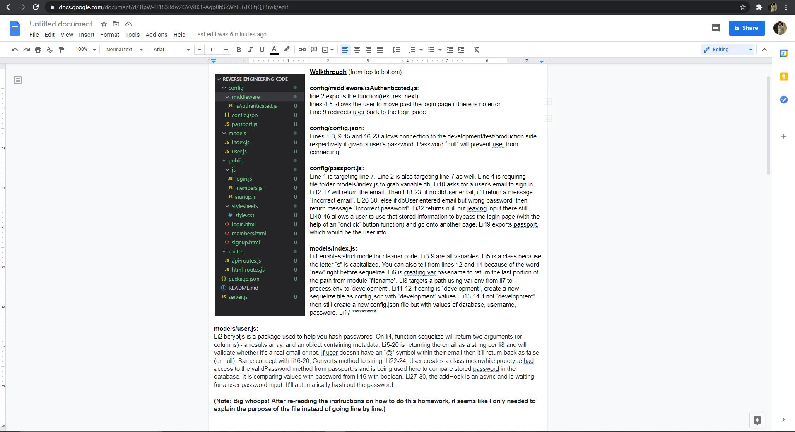

# Reverse-Engineering-Code 

## Purpose of this activity

The purpose of this activity is to provide a walk-through of how these files work and what the purposes of it is for. It's to briefly tell, let's say a client, the functionality of it in a quick but effective manner as of why we need these files and what it's doing so that they have a functioning website.

## Screenshots

## Links

Deployed: https://docs.google.com/document/d/1lpW-Fl183BdwZGVV8K1-Agp0hSkWhEJ61OjtjQ14iwk/edit || 
https://docs.google.com/document/d/1lpW-Fl183BdwZGVV8K1-Agp0hSkWhEJ61OjtjQ14iwk/edit?usp=sharing

GitHub: https://github.com/fongvang09/Reverse-Engineering-Code
